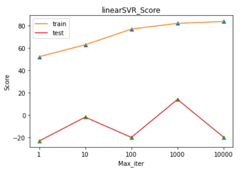
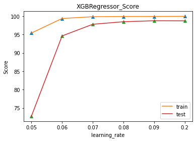

##Offshore Platform Data Correlation Analysis##

### Overview
This project analyzes sensor data collected from marine buoys to predict the replacement timing of mooring chains in offshore platforms. By preprocessing environmental and buoy data, finding meaningful correlations, and applying machine learning models, the project demonstrates the feasibility of predicting fatigue and maintenance cycles of mooring systems.

### Objectives
- Collect and preprocess marine sensor data from buoys.  
- Discover correlations between environmental factors (wind, current, airgap, ...) and buoy data (tension, tilt, position, ...).  
- Build predictive models to estimate the fatigue and replacement timing of mooring chains.  
- Visualize prediction results and compare with actual data.  

### 🛠️ Data Description
- **Environmental Data:** AIRGAP, CURRENT_DEPTH, CURRENT_SPEED, WIND_DIRECTION, WIND_SPEED  , etc..
- **Buoy Data:** MOORING_TENSION, MOORING_LENGTH, MOTION_TILT(X, Y), MOTION_YAW, POSITION(X, Y), etc..

### 🔎 Key Steps
1. **Data Preprocessing & Outlier Detection**  
   - Removed sensor errors and irregular patterns.
   - Selected stable datasets as training data.

2. **Correlation Analysis**  
   - Checked variable correlations, found no irrelevant features.  
   - Decided to use the full dataset for modeling.  

3. **Machine Learning Models**  
   - Applied LinearSVR as a baseline model.  
   - Improved the baseline by introducing XGBoost, which captured nonlinear patterns more effectively.  
   - Tuned hyperparameters while preventing overfitting.

### Results & Insights
- Predicted graphs showed similar trends to real data, validating the approach.  
- Demonstrated the potential of using marine sensor data for predictive maintenance.  
- Highlighted the importance of appropriate dataset selection and preprocessing.  
- Suggested that long-term monitoring of natural phenomena (currents, winds) enables reliable fatigue prediction of mooring systems.  

---

### Model Improvement From LinearSVR to XGBoost

To evaluate predictive performance, we compared **LinearSVR** and **XGBoost** models.

#### LinearSVR

- Training score steadily increases with more iterations.  
- Test score remains unstable and often negative → **poor generalization**.  
- LinearSVR struggles with the nonlinear, complex relationships in marine data.  

#### XGBoost

- Both training and test scores achieve consistently **high performance**.  
- With learning_rate between 0.07–0.1, accuracy exceeds 95%.  
- XGBoost effectively captures nonlinearities and variable interactions.  

### Interpretation
- **LinearSVR**: Limited in handling nonlinear, high-dimensional marine data → weak predictive power.  
- **XGBoost**: Strong predictive accuracy and robustness, suitable for long-term fatigue prediction.  

### Conclusion
XGBoost significantly outperformed LinearSVR in this project.  
It proved to be a reliable model for predicting mooring chain fatigue trends and supported the development of **data-driven maintenance scheduling** for offshore platforms.  

---

### Impact
- Supports **data-driven decision-making** for maintenance schedules in offshore platforms.  
- Enables interpolation of missing sensor data to enhance dataset completeness.  
- Provides a foundation for further research in predictive maintenance using real-time environmental data.  
