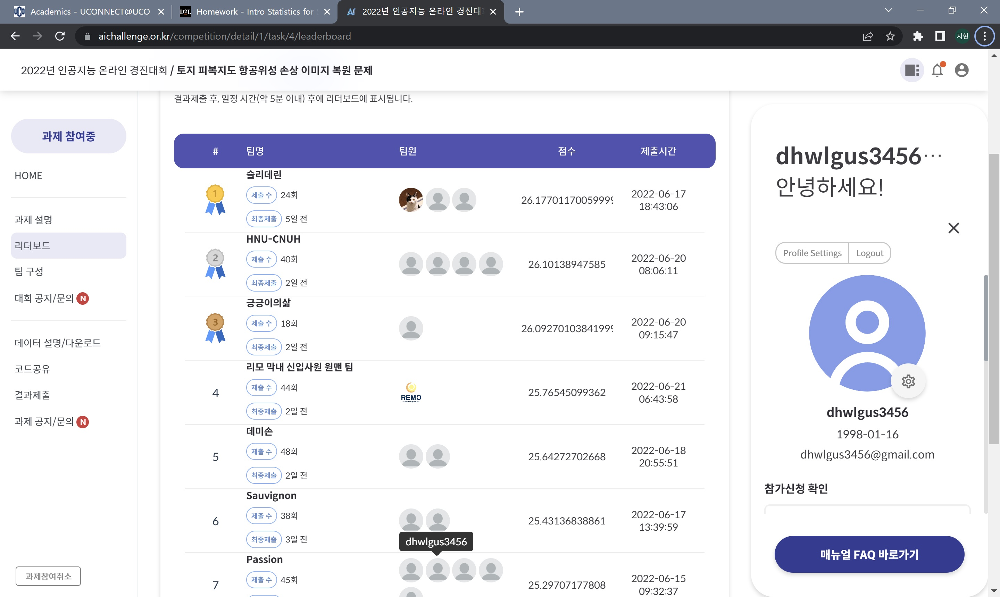

# Hackathon Participation – AI Challenge (Satellite Image Inpainting)

## 📖 Overview
This project documents my participation in the **AI Online Competition** hosted by the **National IT Industry Promotion Agency (NIPA)** in June 2022.  
The challenge theme was **satellite image inpainting**, where the task was to fill in missing or sensitive regions in satellite images with natural and realistic content using AI.  

---

## 🏆 Competition Result
- **Event:** AI Online Competition – Satellite Image Inpainting  
- **Organizer:** National IT Industry Promotion Agency (NIPA), Korea  
- **Date:** June 2022  
- **Placement:** **7th place out of 43 teams**  
- Performance gap with the 1st place team was minimal (**~1 PSNR difference**).  

---

## ⚙️ Approach
1. **Problem Statement**  
   - Satellite images with deliberately removed sensitive regions were provided.  
   - Goal: Reconstruct missing regions realistically and seamlessly.  

2. **Techniques Used**  
   - **Diffusion-based models** for generative image completion.  
   - **Transformer architectures** for contextual understanding.  
   - **Pre-trained models** fine-tuned for the competition dataset.  

3. **Optimization**  
   - Balanced between **fidelity (sharpness, PSNR)** and **realism**.  
   - Fine-tuning allowed competitive performance with relatively limited training resources.  

---

## 📊 Outcome
- Achieved **7th place** among 43 teams.  
- Demonstrated that fine-tuned **diffusion + transformer models** can produce highly realistic inpainting results.  
- Showed potential for further improvement with larger training and resource allocation.  

---

## 🚀 Key Takeaways
- **Generative AI** techniques like diffusion and transformers are powerful tools for inpainting tasks.  
- **Fine-tuning pre-trained models** provides strong results even in limited time/compute settings.  
- Small performance gaps at the top (1 PSNR) highlight the competitiveness of the field.  

---
