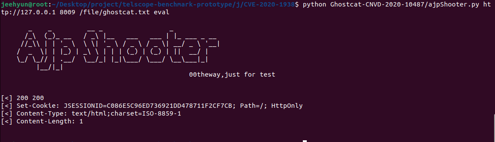

# Attack Details of a Cloud Case

## Background 

Ghostcat is a serious vulnerability in Tomcat discovered by security researcher of Chaitin Tech. Due to a flaw in the Tomcat AJP protocol, an attacker can read or include any files in the webapp directories of Tomcat. For example, An attacker can read the webapp configuration files or source code. In addition, if the target web application has a file upload function, the attacker may execute malicious code on the target host by exploiting file inclusion through Ghostcat vulnerability.

## Affected Versions

Apache Tomcat 9.x < 9.0.31

Apache Tomcat 8.x < 8.5.51

Apache Tomcat 7.x < 7.0.100

Apache Tomcat 6.x

## Story

An attacker uploads a file named ghostcat.txt which is containing malicious JSP script code to the server, and using ajpshooter file to send command to execute malicious jsp script by AJP protocol, which finally can result in remote code execution as web shell. By this vulnerability, attacker gain account informations and its passwords using "cat /etc/passwd" command.

### Exploiting
Attacker goes to "http://SERVERUP:8080/file.jsp" to upload malicious JSP scripte code

Attacker using ajpshooter.py to using AJP protocol to exploit

Attacker goes to "http://SERVERIP:8080/cmd.jsp", which is web shell for gaining server informations

When Attacker type "cat /etc/passwd" in the web shell

