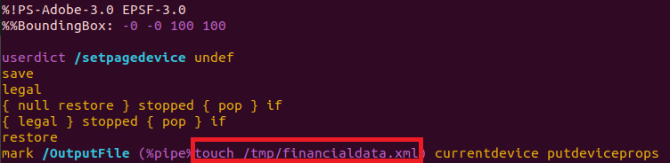
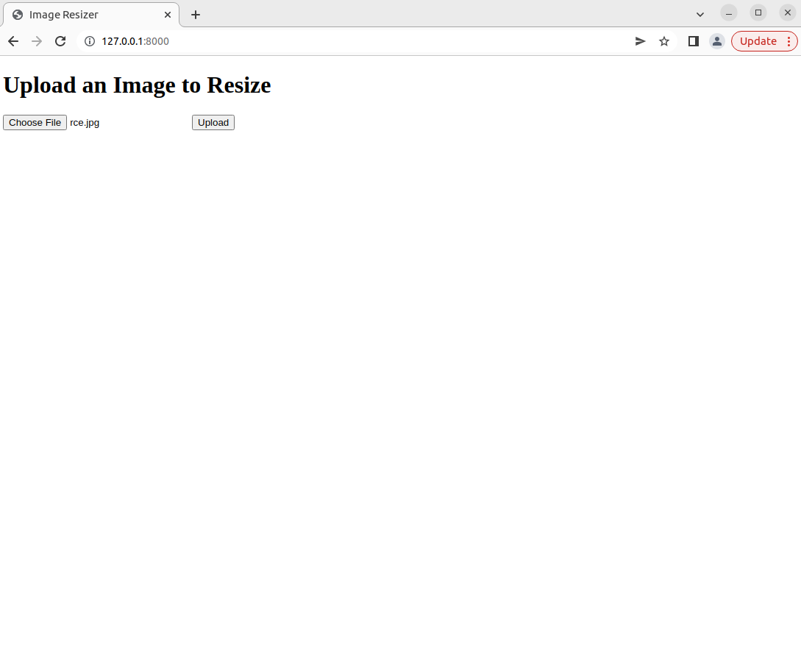
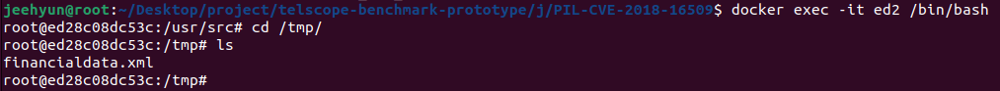

# Attack Details of a Cloud Case

## Background 

Ghostscript is a suite of software based on an interpreter for Adobe Systems PostScript and Portable Document Format (PDF) page description languages. Somehow, Ghostscript is exist in the production server (e.g. `/usr/local/bin/gs` or `/usr/bin/gs`) even when no application use it directly because Ghostscript is installed as dependency of another software (e.g. ImageMagick). Bunch of vulnerabilities were found in Ghostscript; one of them is CVE-2018-16509 (discovered by Tavis Ormandy from Google Project Zero), a vulnerability that allows exploitation of -dSAFER bypass in Ghostscript before v9.24 to execute arbitrary commands by handling a failed restore (grestore) in PostScript to disable LockSafetyParams and avoid invalidaccess. This vulnerability is reachable via libraries such as ImageMagick or image library in the programming language with Ghotscript wrapper (PIL/Pillow in this example).

## Story

An attacker uploads a file named rce.jpg which is containing malicious image file(a specially-crafted EPS image, not a real JPG) to execute `touch /tmp/financialdata.xml' in the server, which file could be exchange the content. 

### Exploiting
Write command after '%pipe%' to execute the command in the server.

Attacker goes to "http://SERVERIP:8000" to upload malicious image

In the server:

The command works well.
